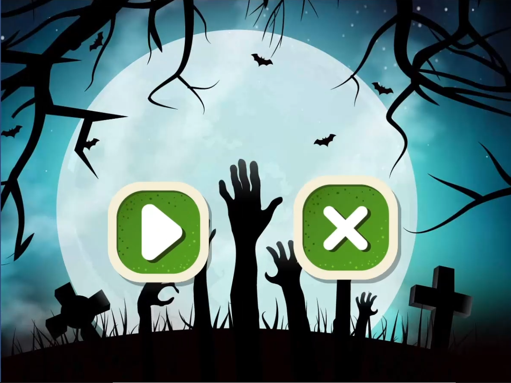
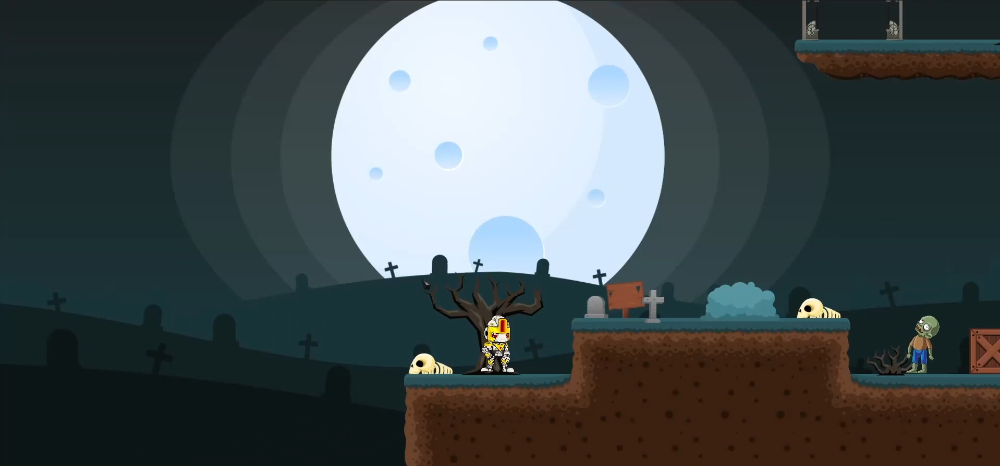
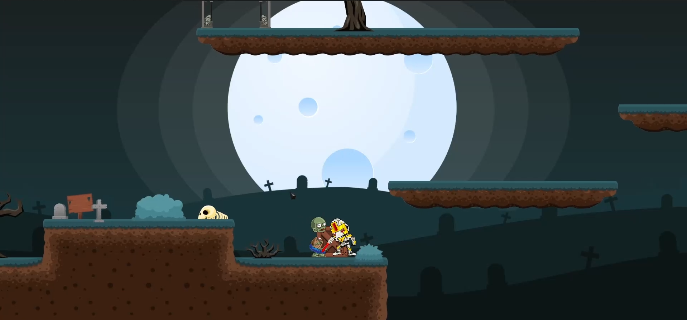
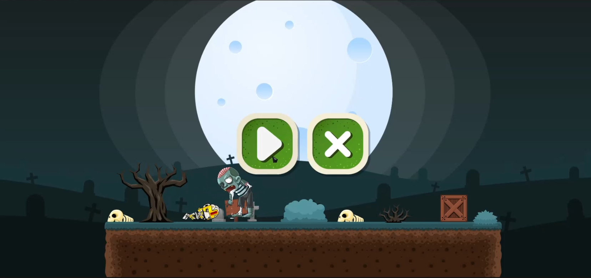

<h1 align="center">
   
  Robot VS Zombie
   
</h1>

<h4 align="center"> A small 2D PC game where you can fight with zombies and a zombie boss as a Robot, built on top of <a href="https://unity.com/" target="_blank" style="color:##0276E8;">Unity
Game engine </a>.</h4>

## Table of Contents
* [Video](#video)
* [Screenshots](#screenshots)
* [About the Project](#about-the-project)
* [Key Features](#key-features)
* [Built With](#built-with)
* [License](#license)
* [Contact](#contact)

## Video

https://github.com/AnikKazi-dev/Robot-VS-Zombie-Unity_engine-/assets/36131816/10ebbcb2-c8cd-4e15-b76f-c4113bb58e01

## Screenshots 

  
  
  
  

## About the project

* Small PC game
* Developed with Unity Engine

## Key Features

* A clean UI
* Control a Robot protagonist
* Fight with zombies with a laser sword
* Zombie attacks the protagonist within a certain range
* The 2nd Round has a big zombie boss
* Need to kill the boss to beat the game

## Built With

This software uses the following packages:

- [Unity Engine](https://unity.com/)
- [C#](https://unity.com/how-to/learning-c-sharp-unity-beginners)
- [Visual Studio Code](https://code.visualstudio.com/)

## Contact

>  - [GitHub](https://github.com/AnikKazi-dev) 
>  - [LinkedIn](https://www.linkedin.com/in/kazi-anik-islam-7a2978172/)
